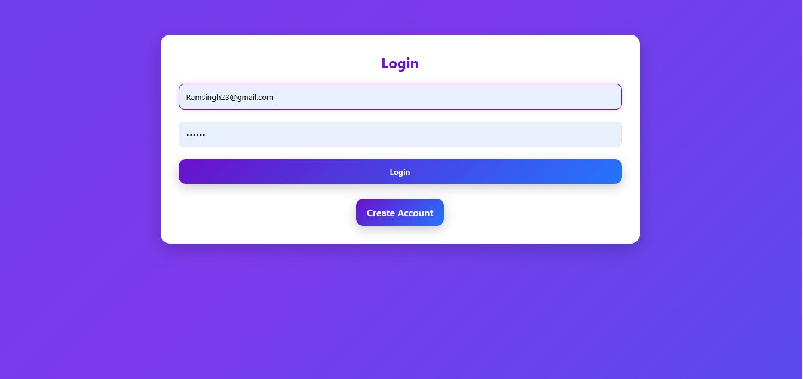
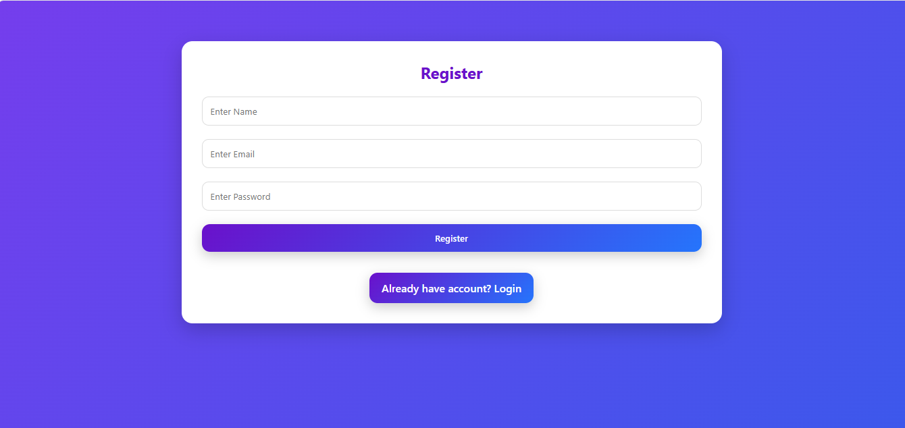
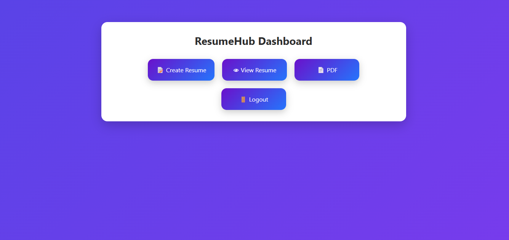
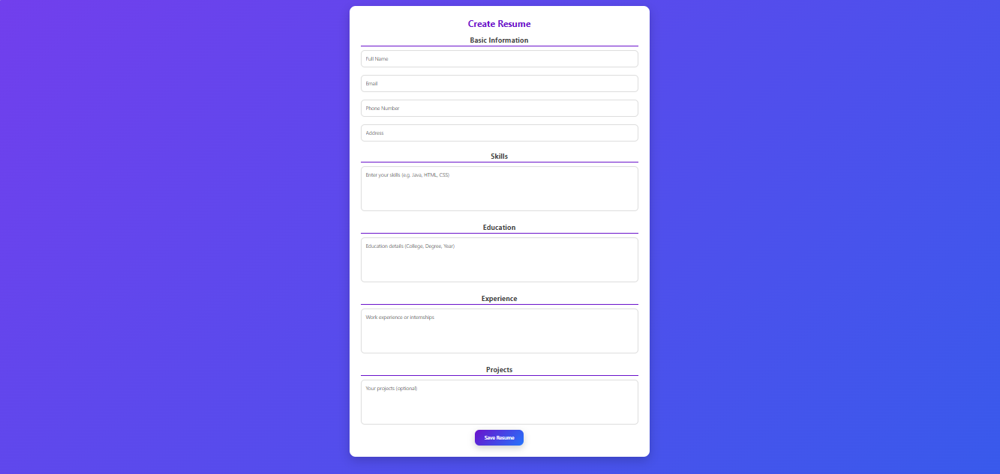
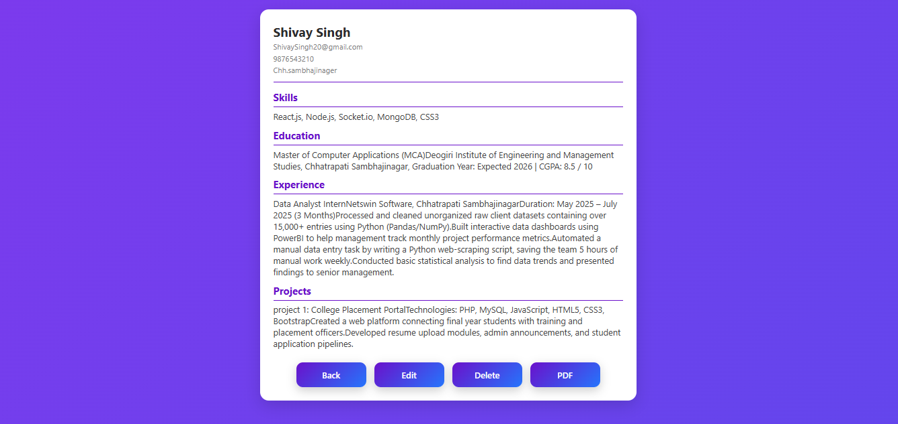
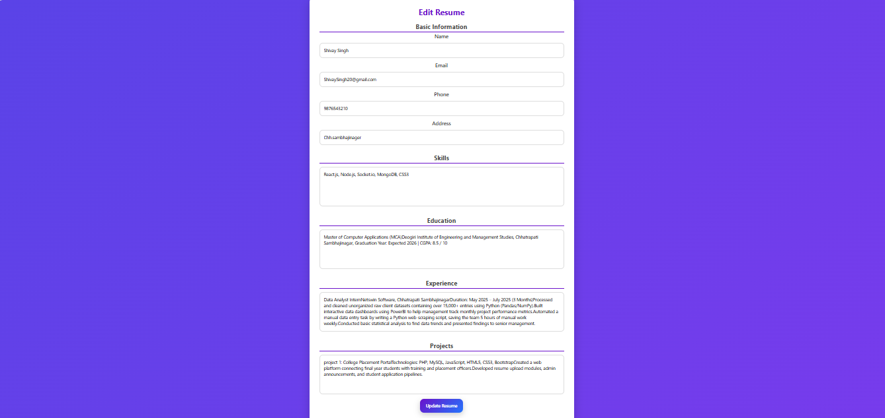
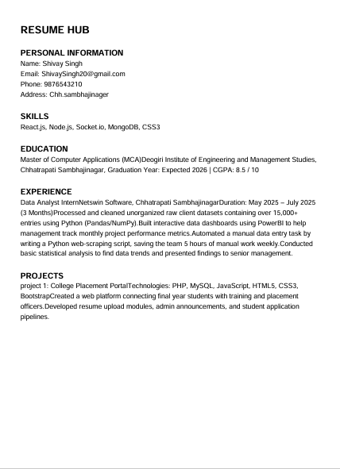

# Resume Hub

Resume Hub is a Java-based web application that enables users to create ATS-friendly resumes online. Users can register, log in, create, edit, view, delete, and download resumes as PDF. The application is developed using Java, JSP, Servlets, MySQL, JDBC, and iText PDF.

---

## 🚀 Live Demo

🔗 **Project Link:**  
LIVE_DEMO_LINK

---

## ✨ Features

- 👤 User Registration & Login
- 📝 Create Professional Resume
- ✏️ Edit Existing Resume
- 👀 View Resume
- 🗑️ Delete Resume
- 📄 Download Resume as PDF
- 💾 MySQL Database Integration
- 🎨 Clean and Responsive User Interface

---

## 🛠️ Technologies Used

- Java
- JSP
- Servlets
- JDBC
- MySQL
- HTML5
- CSS3
- Apache Tomcat
- iText PDF

---

## 📸 Project Output

### 🏠 Home Page


---

### 🔐 Login Page



---

### 📝 Register Page



---

### 📊 Dashboard



---

### 📄 Resume Form



---

### 👀 View Resume



---

### ✏️ Edit Resume



---

### 📥 PDF Output



---

## ⚙️ Installation

1. Clone the repository

```bash
git clone https://github.com/Sanjnaa2004/Resume_hub.git
```

2. Import the project into Eclipse.

3. Configure Apache Tomcat.

4. Import the MySQL database.

5. Update database credentials in `DBConnection.java`.

6. Run the project on Tomcat.

---

## 📂 Project Structure

```
Resume_hub/
│
├── src/
├── Output/
├── README.md
└── ...
```

---

## 👩‍💻 Developer

**Er.Sanjana Santosh Wadekar**

GitHub: https://github.com/Sanjnaa2004

---

⭐ If you like this project, don't forget to give it a Star!
